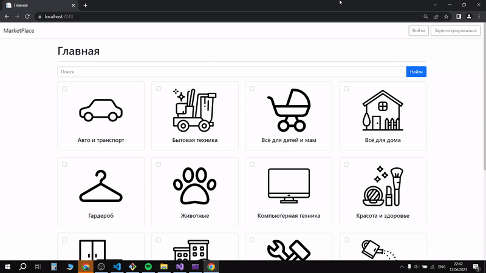

# MarketPlace

MarketPlace – an online store developed using ASP.NET MVC. 

This project is a course work on the discipline "Object-oriented programming".

## Content

- [Description](#description)
- [Application Interface](#application-interface)
  - [Admin](#admin-interface)
  - [Seller](#seller-interface)
  - [Customer](#customer-interface)
  - [Guest](#guest-interface)
- [Use Case Diagrams](#use-case-diagrams)
  - [Admin](#admin-use-case-diagram)
  - [Seller](#seller-use-case-diagram)
  - [Customer](#customer-use-case-diagram)
  - [Guest](#guest-use-case-diagram)
- [UML Diagrams](#uml-diagrams)
  - [DAL](#dal-diagram)
  - [BLL](#bll-diagram)
  - [WEB](#web-diagram)
- [Installation](#installation)
- [Usage](#usage)
- [Author](#author)
- [License](#license)

## Description

MarketPlace is an online store that allows users to browse and purchase products. The application provides the following features:
- User registration and authentication.
- Product search and browsing.
- Adding products to the shopping cart.
- Order placement and payment.
- Product, shop and user management for administrators.
- Product management for sellers.

## Application Interface

### Admin Interface

### Seller Interface

### Customer Interface

### Guest Interface

## Use Case Diagrams

### Admin Use Case Diagram

### Seller Use Case Diagram

### Customer Use Case Diagram

### Guest Use Case Diagram

## UML Diagrams

### DAL Diagram

### BLL Diagram

### WEB Diagram

## Installation

1. Clone the repository to your local machine.
2. Open the project in your development environment.
3. Install the required dependencies using LibMan.

## Usage

1. Build the project and run it on a local server.
2. Open a web browser and navigate to [http://localhost:8000](http://localhost:8000).

## Author

Project author: Dzianis Konchyk.

## License

This project is licensed under the MIT License - see the [LICENSE](LICENSE) file for details.